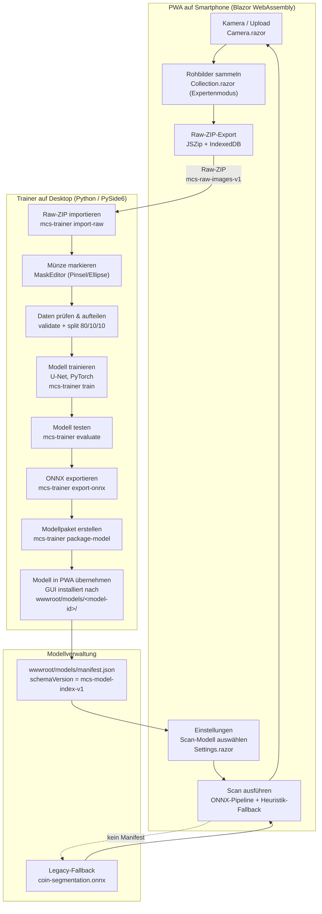

# Projektübersicht – MagicCoinSnapper

## Kurzprofil

**MagicCoinSnapper** ist eine clientseitige Blazor WebAssembly PWA für Zauberer/Conjurer in Bühnenshows. Kein Backend, keine externe API. UI-Sprache Deutsch, Smartphone-first, dunkle Bühnenoptik.

## Aktueller Stand

- **Kamera-Workflow** vollständig: Rückkamera (`getUserMedia`), Foto aufnehmen (PNG), Upload (PNG/JPEG, max 10 MB), Vorschau, Speichern (Download), Löschen.
- **Bildbereitstellung** über `ImageStateService`: hält Originalbild und optional ein freigestelltes Münzbild im Speicher.
- **Münzerkennung / Scan-Logik**: Browserseitige ONNX-Pipeline mit lokalem Heuristik-Fallback erzeugt ein eng zugeschnittenes PNG mit transparentem Hintergrund.
- **Bildersammlung** vorbereitet: Expertenmodus mit Rohbildsammlung, IndexedDB-Speicherung und ZIP-Export für den separaten Desktop-Trainer. Der Desktop-Trainer ist mittlerweile vollständig implementiert (CLI, ML-Pipeline, PySide6-GUI) und kann das Raw-ZIP importieren, annotieren, trainieren und ONNX exportieren; siehe `trainer/README.md`.
- **Trainer** vollständig umgesetzt: Python-3.12-Paket `mcs_trainer` mit CLI, ML-Pipeline und PySide6-GUI. Die GUI führt den Workflow bis zur PWA-Übernahme aus und installiert Modelle unter `wwwroot/models/<model-id>/`.
- **Settings**: Expertenmodus und Scan-Modell-Auswahl aus `wwwroot/models/manifest.json`; Legacy-Fallback auf `wwwroot/models/coin-segmentation.onnx`.
- Build: `dotnet build` kompiliert fehlerfrei, 0 Fehler, 0 Warnungen.

## Tech-Stack

| Bereich           | Technologie                                      |
|-------------------|--------------------------------------------------|
| Framework         | Blazor WebAssembly (`Microsoft.NET.Sdk.BlazorWebAssembly`) |
| SDK / Laufzeit    | .NET 10 (`net10.0`, LTS)                         |
| UI-Bibliothek     | MudBlazor 9.5.0                                  |
| Pakete            | `Microsoft.AspNetCore.Components.WebAssembly` 10.0.9 + `.DevServer`, `onnxruntime-web`, `jszip` |
| Sprachfeatures    | Nullable enabled, ImplicitUsings enabled         |
| PWA               | Manifest + Service Worker (Dev/Published)        |
| Styling           | MudBlazor, keine Bootstrap/CDN-Fonts, System-Font-Stack |
| Hosting (Dev)     | IIS Express HTTPS Port 44332 / HTTP 36643, `dotnet run` auf Ports 7106/5159 |

## End-to-End Workflow



## Architektur (Kernpunkte)

```
Program.cs     → MudBlazor-Services, HttpClient, ImageStateService
App.razor      → Router mit MainLayout, NotFoundPage
Layout/
  MainLayout.razor     → MudLayout: AppBar, responsive Drawer, NavMenu, Bottom-Action "Scan starten"
  MainLayout.razor.css → Shell-Styles (Safe Areas, Bottom-Action, Hintergrund)
Pages/
  Index.razor   → /           Hero, Statuskarten, Scan-Button
  Camera.razor  → /camera     Kamera/Upload/Vorschau/Scan/Speichern + collocated JS-Modul
  Camera.razor.js             getUserMedia (Rückseite), Capture, Scan-Hook, Blob-Download
  Collection.razor → /collection  Rohbilder sammeln und als ZIP exportieren (Expertenmodus)
  Collection.razor.js             IndexedDB fuer Rohbilder, Raw-ZIP-Export
  Settings.razor → /settings  Expertenmodus und Scan-Modell-Auswahl
  Ueber.razor   → /ueber      Zweck- und Technikbeschreibung
  NotFound.razor → /not-found 404
Models/
  RawImageSample.cs → Metadaten fuer Rohbilder und Raw-ZIP-Export
Services/
  ImageStateService.cs → Originalbild + freigestelltes Ergebnis, OnChanged-Event
  AppSettingsService.cs → lokaler Expertenmodus und Scan-Modell-Auswahl via localStorage
  RawImageCollectionService.cs → JS-Interop-Wrapper fuer IndexedDB-Rohbilder
wwwroot/
  js/                  → Coin-Processing, Modellregistry, ONNX-/Heuristik-Pipeline
  models/              → Modellverzeichnisse, manifest.json und Legacy-ONNX-Fallback
  vendor/              → lokale onnxruntime-web- und jszip-Assets
```

## Design- und UI-Kontext

- Verbindliches Designsystem: **`DESIGN.md`**. MudBlazor-Theme in `MainLayout.razor` definiert (dunkle Palette, Gold-Primäraction).
- Smartphone-first: `max-width: 520px`, Daumenbedienung, Bottom-Action, Safe Areas.
- Alle Farben/Abstände/Radien/Typografie als CSS-Custom-Properties in `wwwroot/css/app.css`.

## Setup & Befehle

Voraussetzung: .NET 10 SDK installiert.

```pwsh
dotnet build                              # Build verifizieren
dotnet run --project MagicCoinSnapper.csproj  # Dev-Server (Hot Reload)
dotnet publish -c Release                 # PWA-Ausgabe (statisch hostbar)
npm install                               # JS-Abhaengigkeiten installieren und wwwroot/vendor erzeugen
```

```pwsh
.\Tools\Start-Lokaler-Test.bat            # IIS Express (HTTPS 44332) + optional ngrok
.\Tools\Build-GitHubPagesRelease.bat      # Release für GitHub Pages (base-href /MagicCoinSnapper/)
.\Tools\GenerateBuildInfo.ps1 -OutputFile obj\BuildInfo.cs -Version 1.0.0
```

## Hinweise für die Arbeit

- **Kamerazugriff** braucht sicheren Kontext (HTTPS oder `localhost`). IIS Express liefert HTTPS über Port 44332 (selbstsigniert).
- **Service Worker** kann veraltete Assets cachen → bei Problemen Hard-Refresh oder SW deregistrieren.
- **`service-worker-assets.js`** wird beim Publish generiert, nicht manuell editieren.
- **Nicht committen:** `.vs/`, `bin/`, `obj/`, `MagicCoinSnapper.csproj.user`.
- **UI-Änderungen** müssen `DESIGN.md` folgen.
- **Modelle** werden über `wwwroot/models/manifest.json` (`schemaVersion = mcs-model-index-v1`) angeboten. Ohne Manifest bleibt `wwwroot/models/coin-segmentation.onnx` als Legacy-Fallback aktiv.

## Referenzen

- `DESIGN.md` – verbindliches Designsystem (Farben, Typografie, Layouts, Komponentenregeln)
- `PLAN.md` – Umsetzungshistorie, Detailentscheidungen, aufgetretene Probleme
- `trainer/docs/model-management.md` – Modellinstallation, Manifest und PWA-Auswahl
- `AGENTS.md` – Regeln für KI-gestützte Arbeit am Projekt
